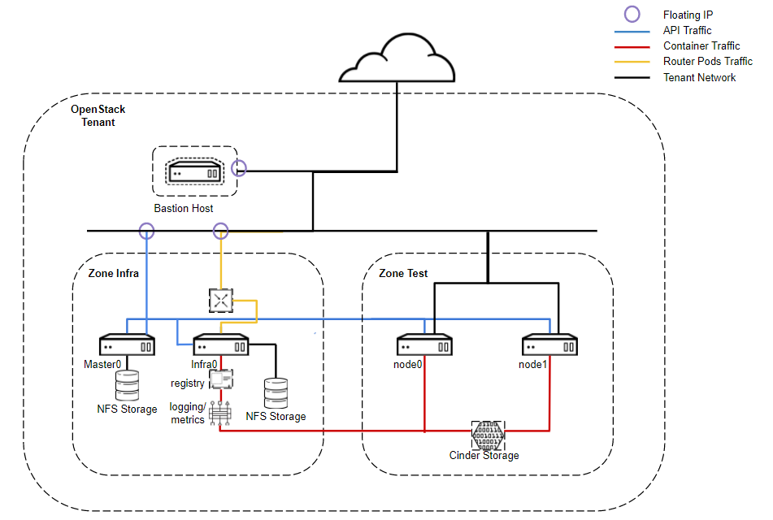

# General
The purpose of this project is to provide a simple, yet flexible deployment of OpenShift on OpenStack using a three step process. 

# Contribution
If you want to provide additional features, please feel free to contribute via pull requests or any other means.
We are happy to track and discuss ideas, topics and requests via 'Issues'.

# Pre-requisites
* Working OpenStack deployment. Tested is OpenStack Pike (12) using RDO.
* RHEL or CentOS 7 image. Tested is RHEL 7.4.
* An openstack ssh key for accessing instances.
* Properly configured security group that allows ICMP and ssh at minimum.
* A pre-configured provider network with at least three available floating ips.
* A router that has the provider network configured as a gateway.
* Properly configured cinder and nova storage.

For more information on how to properly setup OpenStack see below:

# Tested Deployment Options
```Single Master```
Single Master deployment is 1 Master, 1 Infra node and X number of App nodes. This configuration is a non-HA setup, ideal for test environments.


# Install


```[OpenStack Controller]```

Authenticate OpenStack Credentials
```
# source /root/keystonerc_admin
```

Disable host key checking
```
# export ANSIBLE_HOST_KEY_CHECKING=False
```

Deploy OpenStack Infrastructure for OpenShift
```
# ansible-playbook deploy-openstack-infra.yml --private-key=/root/admin.pem -e @vars.yml
```


Get ip address of the bastion host.
```
# openstack stack output show -f value -c output_value openshift ip_address

{
  "masters": [
    {
      "name": "master0",
      "address": "144.76.134.230"
    }
  ],
  "bastion": {
    "name": "bastion",
    "address": "144.76.134.226"
  },
  "nodes": [
    {
      "name": "node0",
      "address": "10.0.1.8"
    },
    {
      "name": "node1",
      "address": "10.0.1.13"
    }
  ],
  "infras": [
    {
      "name": "infra0",
      "address": "144.76.134.228"
    }
  ]
}
```

SSH to the bastion host using cloud-user and key.
```
ssh -i /root/admin.pem cloud-user@144.76.134.226
```

```[Bastion Host]```

Authenticate OpenStack Credentials
```
[cloud-user@bastion ~]$ source /home/cloud-user/keystonerc_admin
```

Disable host key checking
```
[cloud-user@bastion ~]$ export ANSIBLE_HOST_KEY_CHECKING=False
```

Prepare the nodes for deployment of OpenShift.
```
[cloud-user@bastion ~]$ ansible-playbook playbooks/prepare-openshift.yml --private-key=/home/cloud-user/admin.pem -e @playbooks/vars.yml

PLAY RECAP **************************************************************************************************************************************
bastion : ok=15 changed=7 unreachable=0 failed=0
infra0 : ok=18 changed=13 unreachable=0 failed=0
localhost : ok=7 changed=6 unreachable=0 failed=0
master0 : ok=18 changed=13 unreachable=0 failed=0
node0 : ok=18 changed=13 unreachable=0 failed=0
node1 : ok=18 changed=13 unreachable=0 failed=0
```


```[Bastion Host]```

Deploy OpenShift.
```
[cloud-user@bastion ~]$ ansible-playbook -i /home/cloud-user/openshift-inventory --private-key=/home/cloud-user/admin.pem -vv /usr/share/ansible/openshift-ansible/playbooks/byo/config.yml
```

Login to OpenShift Master
```
[cloud-user@bastion ~]$ ssh -i /home/cloud-user/admin.pem cloud-user@master0
```

Authenticate as system:admin user.
```
[cloud-user@master0 ~]$ oc login -u system:admin -n default
```

Create a new user in OpenShift for API access.
```
[cloud-user@master0 ~]$ sudo htpasswd -c /etc/origin/master/htpasswd admin
```

Make user OpenShift Cluster Administrator
```
[cloud-user@master0 ~]$ oadm policy add-cluster-role-to-user cluster-admin admin
```

Authenticate as new user.
```
[cloud-user@master0 ~]$ oc login -u admin -n default
```

Login in to UI.
```
https://master0.144.76.134.230.xip.io:8443
```

