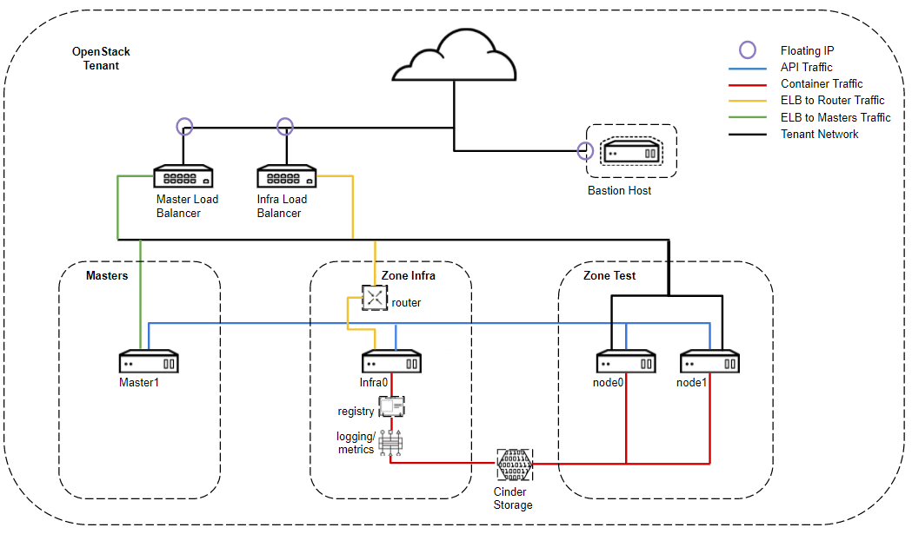
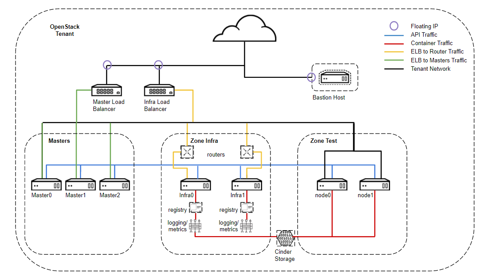

# General
The purpose of this project is to provide a simple, yet flexible deployment of OpenShift on OpenStack using a three step process. This guide assumes you are familiar with OpenStack.

# Contribution
If you want to provide additional features, please feel free to contribute via pull requests or any other means.
We are happy to track and discuss ideas, topics and requests via 'Issues'.

# Releases
For each release of OpenShift a release branch will be created. Starting with OpenShift 3.9 we will follow the OpenShift release version so it is easy to tell what release branch goes with OpenShift version.

* release-1.0 OpenShift 3.7 and earlier
* release-3.9 OpenShift 3.9

In addition I would like to metion I borrowed a lot of ideas from two other projects.
* [OpenShift setup for Hetzner from RH SSA team](https://github.com/RedHat-EMEA-SSA-Team/hetzner-ocp)
* [OpenShift on OpenStack](https://github.com/redhat-openstack/openshift-on-openstack)

# Pre-requisites
* Working OpenStack deployment. Tested is OpenStack 12 & 13 (Pike & Queens) using RDO.
* RHEL 7 image. Tested is RHEL 7.4.
* An openstack ssh key for accessing instances.
* A pre-configured provider (public) network with at least three available floating ips.
* Flavors configured for OpenShift. These are only recommendations.
  * ocp.master  (2 vCPU, 4GB RAM, 30 GB Root Disk)
  * ocp.infra   (4 vCPU, 16GB RAM, 30 GB Root Disk)
  * ocp.node    (2 vCPU, 4GB RAM, 30 GB Root Disk)
  * ocp.bastion (1 vCPU, 4GB RAM, 30 GB Root Disk)
* A router that has the provider network configured as a gateway.
* Properly configured cinder and nova storage.
  * Make sure you aren't using default loop back and have disabled disk zeroing in cinder/nova for LVM.

Increase at least volumes and secgroups in default project quota
```
# openstack quota set --volumes 1000 --secgroup-rules 100 <Project Name>
```

More information on setting up proper OpenStack environment can be found [here](https://keithtenzer.com/2018/02/05/openstack-12-pike-lab-installation-and-configuration-guide-with-hetzner-root-servers/).

# Tested Deployments
```Single Master - Non HA```

Single Master deployment is 1 Master, 1 Infra node and X number of App nodes. This configuration is a non-HA setup, ideal for test environments.


```Multiple Master - HA```

Multiple Master deployment is 3 Master, 2 Infra node and X number of App nodes. This configuration is an HA setup. By default etcd and registry are not using persistent storage. This would need to be configured post-install manually at this time if those should be persisted.


# Install


```[OpenStack Controller]```

Clone Git Repository
```
# git clone https://github.com/ktenzer/openshift-on-openstack-123.git
```

Checkout release branch 3.9
```
# git checkout release-3.9
```

Change dir to repository
```
# cd openshift-on-openstack-123
```

Configure Parameters
```
# cp sample-vars.yml vars.yml
```
```
# vi vars.yml
---
### OpenStack Setting ###
openstack_user: admin
openstack_passwd: <password>
openstack_ip: <ip address>
openstack_project: <project>
domain_name: ocp3.lab
dns_forwarders: [213.133.98.98, 213.133.98.99]
external_network: public
service_subnet_cidr: 192.168.1.0/24
router_id: <router id from 'openstack router list'>
image: rhel74
ssh_user: cloud-user
ssh_key_path: /root/admin.pem
ssh_key_name: admin
stack_name: openshift
openstack_version: 13
contact: admin@ocp3.lab
heat_template_path: /root/openshift-on-openstack-123/heat/openshift.yaml

### OpenShift Settings ###
openshift_version: 3.9
docker_version: 1.13.1
openshift_ha: true
registry_replicas: 2
openshift_user: admin
openshift_passwd: <password>

### Red Hat Subscription ###
rhn_username: <user>
rhn_password: <password>
rhn_pool: <pool>

### OpenStack Instance Count ###
master_count: 3
infra_count: 2
node_count: 2

### OpenStack Instance Group Policies ###
### Set to 'affinity' if only one compute node ###
master_server_group_policies: "['anti-affinity']"
infra_server_group_policies: "['anti-affinity']"
node_server_group_policies: "['anti-affinity']"

### OpenStack Instance Flavors ###
bastion_flavor: ocp.bastion
master_flavor: ocp.master
infra_flavor: ocp.infra
node_flavor: ocp.node
```

Note: If you want to run a single load balancer (to save floating ips) for masters and infra, instead of default two use following heat template ```heat_template_path: /root/openshift-on-openstack-123/heat/openshift_single_lbaas.yaml```.

Authenticate OpenStack Credentials
```
# source /root/keystonerc_admin
```

Disable host key checking
```
# export ANSIBLE_HOST_KEY_CHECKING=False
```

Deploy OpenStack Infrastructure for OpenShift
```
# ansible-playbook deploy-openstack-infra.yml --private-key=/root/admin.pem -e @vars.yml
```


Get ip address of the bastion host.
```
# openstack stack output show -f value -c output_value openshift ip_address

{
  "masters": [
    {
      "name": "master0",
      "address": "192.168.1.19"
    },
    {
      "name": "master1",
      "address": "192.168.1.16"
    },
    {
      "name": "master2",
      "address": "192.168.1.15"
    }
  ],
  "lb_master": {
    "name": "lb_master",
    "address": "144.76.134.230"
  },
  "infras": [
    {
      "name": "infra0",
      "address": "192.168.1.10"
    },
    {
      "name": "infra1",
      "address": "192.168.1.11"
    }
  ],
  "lb_infra": {
    "name": "lb_infra",
    "address": "144.76.134.229"
  },
  "bastion": {
    "name": "bastion",
    "address": "144.76.134.228"
  },
  "nodes": [
    {
      "name": "node0",
      "address": "192.168.1.6"
    },
    {
      "name": "node1",
      "address": "192.168.1.13"
    }
  ]
}
```

SSH to the bastion host using cloud-user and key.
```
ssh -i /root/admin.pem cloud-user@144.76.134.229
```

```[Bastion Host]```

Change dir to repository
```
# cd openshift-on-openstack-123
```

Disable host key checking
```
[cloud-user@bastion ~]$ export ANSIBLE_HOST_KEY_CHECKING=False
```

Prepare the nodes for deployment of OpenShift.
```
[cloud-user@bastion ~]$ ansible-playbook prepare-openshift.yml --private-key=/home/cloud-user/admin.pem -e @vars.yml

PLAY RECAP *****************************************************************************************
bastion                    : ok=15   changed=7    unreachable=0    failed=0
infra0                     : ok=18   changed=13   unreachable=0    failed=0
infra1                     : ok=18   changed=13   unreachable=0    failed=0
localhost                  : ok=7    changed=6    unreachable=0    failed=0
master0                    : ok=18   changed=13   unreachable=0    failed=0
master1                    : ok=18   changed=13   unreachable=0    failed=0
master2                    : ok=18   changed=13   unreachable=0    failed=0
node0                      : ok=18   changed=13   unreachable=0    failed=0
node1                      : ok=18   changed=13   unreachable=0    failed=0
```


```[Bastion Host]```

Deploy OpenShift (3.7 or lower).
```
[cloud-user@bastion ~]$ ansible-playbook -i /home/cloud-user/openshift-inventory --private-key=/home/cloud-user/admin.pem -vv /usr/share/ansible/openshift-ansible/playbooks/byo/config.yml
PLAY RECAP *****************************************************************************************
infra0.ocp3.lab            : ok=183  changed=59   unreachable=0    failed=0
infra1.ocp3.lab            : ok=183  changed=59   unreachable=0    failed=0
localhost                  : ok=12   changed=0    unreachable=0    failed=0
master0.ocp3.lab           : ok=635  changed=265  unreachable=0    failed=0
master1.ocp3.lab           : ok=635  changed=265  unreachable=0    failed=0
master2.ocp3.lab           : ok=635  changed=265  unreachable=0    failed=0
node0.ocp3.lab             : ok=183  changed=59   unreachable=0    failed=0
node1.ocp3.lab             : ok=183  changed=59   unreachable=0    failed=0


INSTALLER STATUS ***********************************************************************************
Initialization             : Complete
Health Check               : Complete
etcd Install               : Complete
Master Install             : Complete
Master Additional Install  : Complete
Node Install               : Complete
Hosted Install             : Complete
Service Catalog Install    : Complete
```

Deploy OpenShift (3.9 or higher)

In OpenShift 3.9 the playbook names changed and in addition the pre-requisite playbook was added.

```
[cloud-user@bastion ~]$ ansible-playbook -i /home/cloud-user/openshift-inventory --private-key=/home/cloud-user/admin.pem -vv /usr/share/ansible/openshift-ansible/playbooks/prerequisites.yml
PLAY RECAP *****************************************************************************************
infra0.ocp3.lab            : ok=61   changed=15   unreachable=0    failed=0
localhost                  : ok=11   changed=0    unreachable=0    failed=0
master0.ocp3.lab           : ok=73   changed=15   unreachable=0    failed=0
node0.ocp3.lab             : ok=61   changed=15   unreachable=0    failed=0


INSTALLER STATUS ***********************************************************************************
Initialization             : Complete (0:04:16)
```

Reboot all nodes (masters, infras, nodes and bastion), see Issue 4 below.
```
[cloud-user@bastion ~]$ systemctl reboot
```

```
[cloud-user@bastion ~]$ ansible-playbook -i /home/cloud-user/openshift-inventory --private-key=/home/cloud-user/admin.pem -vv /usr/share/ansible/openshift-ansible/playbooks/deploy_cluster.yml

PLAY RECAP *****************************************************************************************
infra0.ocp3.lab            : ok=136  changed=54   unreachable=0    failed=0
localhost                  : ok=12   changed=0    unreachable=0    failed=0
master0.ocp3.lab           : ok=626  changed=259  unreachable=0    failed=0
node0.ocp3.lab             : ok=77   changed=27   unreachable=0    failed=0


INSTALLER STATUS ***********************************************************************************
Initialization             : Complete (0:01:40)
Health Check               : Complete (0:13:48)
etcd Install               : Complete (0:12:44)
Master Install             : Complete (0:23:33)
Master Additional Install  : Complete (0:27:00)
Node Install               : Complete (0:39:11)
Hosted Install             : Complete (0:03:01)
Web Console Install        : Complete (0:02:00)
Service Catalog Install    : Complete (0:04:39)
```

Run post install playbook
```
[cloud-user@bastion ~]$ ansible-playbook post-openshift.yml --private-key=/home/cloud-user/admin.pem -e @vars.yml

PLAY RECAP **************************************************************************************************************************
infra0                     : ok=4    changed=2    unreachable=0    failed=0
infra1                     : ok=4    changed=2    unreachable=0    failed=0
localhost                  : ok=7    changed=6    unreachable=0    failed=0
master0                    : ok=6    changed=4    unreachable=0    failed=0
master1                    : ok=6    changed=4    unreachable=0    failed=0
master2                    : ok=6    changed=4    unreachable=0    failed=0
node0                      : ok=4    changed=2    unreachable=0    failed=0
node1                      : ok=4    changed=2    unreachable=0    failed=0
```

Login in to UI.
```
https://openshift.144.76.134.226.xip.io:8443
```

# Optional
Configure admin user
```
[cloud-user@bastion ~]$ ssh -i /home/cloud-user/admin.pem cloud-user@master0
```

Authenticate as system:admin user.
```
[cloud-user@master0 ~]$ oc login -u system:admin -n default
```

Make user OpenShift Cluster Administrator
```
[cloud-user@master0 ~]$ oc adm policy add-cluster-role-to-user cluster-admin admin
```

Install Metrics
Set metrics to true in inventory
```
[cloud-user@bastion ~]$ vi openshift_inventory
...
openshift_hosted_metrics_deploy=true
...
```

Run playbook for metrics for OpenShift 3.7
```
[cloud-user@bastion ~]$ ansible-playbook -i /home/cloud-user/openshift-inventory --private-key=/home/cloud-user/admin.pem -vv /usr/share/ansible/openshift-ansible/playbooks/byo/openshift-cluster/openshift-metrics.yml
PLAY RECAP **************************************************************************************************************************
infra0.ocp3.lab            : ok=45   changed=4    unreachable=0    failed=0
infra1.ocp3.lab            : ok=45   changed=4    unreachable=0    failed=0
localhost                  : ok=11   changed=0    unreachable=0    failed=0
master0.ocp3.lab           : ok=48   changed=4    unreachable=0    failed=0
master1.ocp3.lab           : ok=48   changed=4    unreachable=0    failed=0
master2.ocp3.lab           : ok=205  changed=48   unreachable=0    failed=0
node0.ocp3.lab             : ok=45   changed=4    unreachable=0    failed=0
node1.ocp3.lab             : ok=45   changed=4    unreachable=0    failed=0


INSTALLER STATUS ********************************************************************************************************************
Initialization             : Complete
Metrics Install            : Complete
```

Run playbook for metrics for OpenShift 3.9
```
[cloud-user@bastion ~]$ ansible-playbook -i /home/cloud-user/openshift-inventory --private-key=/home/cloud-user/admin.pem -vv /usr/share/ansible/openshift-ansible/playbooks/openshift-metrics/config.yml
PLAY RECAP *****************************************************************************************
infra0.ocp3.lab            : ok=0    changed=0    unreachable=0    failed=0
localhost                  : ok=11   changed=0    unreachable=0    failed=0
master0.ocp3.lab           : ok=217  changed=47   unreachable=0    failed=0
node0.ocp3.lab             : ok=0    changed=0    unreachable=0    failed=0


INSTALLER STATUS ***********************************************************************************
Initialization             : Complete (0:01:34)
Metrics Install            : Complete (0:04:37)
```

Install Prometheus
Set prometheus to true in inventory
```
[cloud-user@bastion ~]$ vi openshift_inventory
...
openshift_hosted_prometheus_deploy=true
...
```
Run playbook for prometheus for OpenShift 3.9
```
[cloud-user@bastion ~]$ ansible-playbook -i /home/cloud-user/openshift-inventory --private-key=/home/cloud-user/admin.pem -vv /usr/share/ansible/openshift-ansible/playbooks/openshift-prometheus/config.yml
PLAY RECAP *****************************************************************************************
infra0.ocp3.lab            : ok=0    changed=0    unreachable=0    failed=0
localhost                  : ok=11   changed=0    unreachable=0    failed=0
master0.ocp3.lab           : ok=217  changed=47   unreachable=0    failed=0
node0.ocp3.lab             : ok=0    changed=0    unreachable=0    failed=0

INSTALLER STATUS ***********************************************************************************
Initialization             : Complete (0:01:34)
Prometheus Install            : Complete (0:04:37)
```

Install Logging
Set logging to true in inventory
```
[cloud-user@bastion ~]$ vi openshift_inventory
...
openshift_hosted_logging_deploy=true
...
```

Run playbook for logging OpenShift 3.7
```
[cloud-user@bastion ~]$ ansible-playbook -i /home/cloud-user/openshift-inventory --private-key=/home/cloud-user/admin.pem -vv /usr/share/ansible/openshift-ansible/playbooks/byo/openshift-cluster/openshift-logging.yml
```

Run Playbook for logging OpenShift 3.9
```
[cloud-user@bastion ~]$ ansible-playbook -i /home/cloud-user/openshift-inventory --private-key=/home/cloud-user/admin.pem -vv /usr/share/ansible/openshift-ansible/playbooks/openshift-logging/config.yml
```

# Issues
## Issue 1: Dynamic storage provisioning using cinder not working
Currently using the OpenStack cloud provider requires using Cinder v2 API. Most current OpenStack deployments will default to v3.
```
Error creating cinder volume: BS API version autodetection failed.
```
If you provision OpenShift volume and it is pending check /var/log/messages on master. If you see this error you need to add following in /etc/origin/cloudprovider/openstack.conf on masters and all nodes then restart node service on node and controller service on master.
```
...
[BlockStorage]
bs-version=v2
...
```

The post-openshift.yml playbook takes care of setting v2 for cinder automatically.

## Issue 2: Service Catalog Install Fails

This seems to be general issue with OpenShift 3.7 installer, somtimes API timeout's occur, it can be ignored or you can re-run playbook to install just service catalog.

## Issue 3: Hosted Install Fails

The registry sometimes fails to complete install due to host resolution of xip.io. Not sure if this is issue in OpenShift 3.7 or environment. Simply re-running hosted playbook resolved the issue and resulted in successful installation.

## Issue 4: Firewalld Error when installing OpenShift 3.9

RHEL 7.5 introduced some changes to firewalld. After installing firewalld, you actually need to reboot your system. The OpenShift 3.9 installer does not account for this, therefore after Step 2, before running OpenShift deployment reboot all nodes and then run OpenShift deployment.
